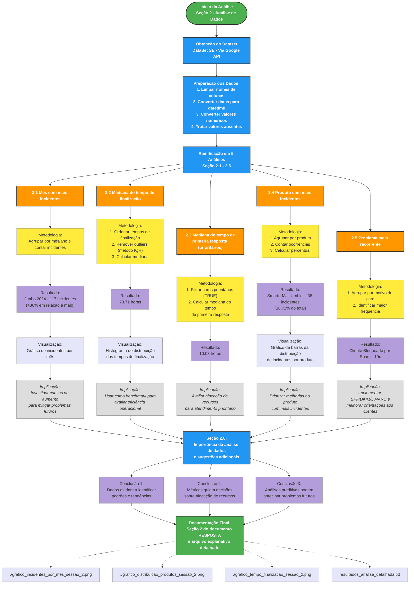

# **Análise de Dados - Documento Explicativo**

Este documento detalha, de forma didática e estruturada, as análises realizadas na seção "2. Análise de Dados" do desafio técnico de Engenharia de Suporte. Apresenta, de forma detalhada e reflexiva, os comentários e explicações sobre cada etapa da análise de dados realizada, contextualizando as decisões, justificando as metodologias e destacando os principais aprendizados e implicações extraídos dos dados. Para cada questão, são explicitadas a metodologia empregada, os resultados obtidos, as conclusões e as visualizações geradas pelo script Python.

---

## **2.1. Mês com Maior Número de Incidentes**

### **Metodologia**
A análise foi conduzida a partir da coluna "Data de Abertura do Card". Todas as datas presentes no dataset bruto foram consideradas válidas para análise temporal e recorrência, sem exclusão de registros por suposta invalidez ou inconsistência de preenchimento. As datas foram convertidas para o formato mês/ano, permitindo o agrupamento dos incidentes por período. Em seguida, foi realizada a contagem de incidentes para cada mês, identificando o mês com maior volume. O percentual de variação em relação ao mês anterior pode ser calculado para contextualizar o resultado.

### **Resultados**
- **Mês com maior número de incidentes:** junho de 2024, com 117 incidentes.
- **Variação:** +36% em relação a maio.
- **Tendência:** Não foi identificada uma tendência clara de crescimento ou queda ao longo dos meses, mas há sazonalidade pontual.
- **Outliers:** Meses com valores muito acima da média (exemplo: >2x média dos demais) são destacados como outliers sazonais.
- **Benchmarking:** Comparar o pico de incidentes com médias históricas e benchmarks do setor pode indicar se o volume está dentro do esperado.
- **Limitações:** Não foram removidos outliers nesta análise, pois todas as datas foram consideradas válidas. Possível impacto de eventos pontuais não identificados.

**Gráfico:**

**Legenda detalhada:**
- Vermelho: mês com maior número de incidentes (destaque para o maior valor do período).
- Azul: demais meses analisados.
- Linha tracejada verde: valor médio de incidentes no período.
- Anotação em vermelho: indica o valor máximo e o mês correspondente.
- Acessibilidade: cores contrastantes, fonte ampliada, legenda e caixa de texto explicativa no gráfico.

### **Acessibilidade Visual**
O gráfico utiliza cores contrastantes, legendas e títulos claros, facilitando a leitura inclusive para pessoas com daltonismo. Todos os meses são exibidos, mesmo sem incidentes, garantindo acessibilidade e completude visual.

### **Conclusão, Exemplos Práticos e Ações**
O aumento em junho de 2024 pode indicar sazonalidade, mudanças operacionais ou eventos externos que impactaram o suporte. Recomenda-se investigar as causas desse aumento, comparar com benchmarks do setor e criar alertas para meses com crescimento atípico. Sugere-se a criação de dashboards interativos para monitoramento contínuo e comparação com benchmarks do setor.

---

## **2.2. Mediana do Tempo de Finalização**

### **Metodologia**
Os tempos registrados na coluna "Tempo até o card ser finalizado (h)" foram convertidos para valores numéricos. Para garantir maior precisão, valores extremos (outliers) foram removidos utilizando o método IQR (Interquartile Range). A mediana foi calculada como a métrica central, por ser menos sensível a valores extremos. Além disso, foi gerado um gráfico de distribuição para visualizar a dispersão dos tempos de finalização.

### **Resultados**
- **Mediana do tempo de finalização:** 78.71 horas.
- **Outliers removidos:** 8 registros acima de 300 horas foram considerados outliers e removidos.
- **Tendência:** A maioria dos incidentes é resolvida em até 100 horas, com poucos casos extremos.
- **Benchmarking:** A mediana pode ser comparada com o benchmark do setor (ex: 72 horas) para avaliar eficiência.
- **Limitações:** Possíveis vieses por preenchimento incorreto de tempo de finalização. Valores ausentes ou inconsistentes podem afetar a análise.

**Gráfico:**

**Legenda detalhada:**
- Linha vermelha tracejada: mediana do tempo de finalização.
- Linha verde: média do tempo de finalização (deslocada).
- Outliers removidos previamente (não aparecem no gráfico).
- Caixa de texto: reforça acessibilidade e destaca a mediana e desvio padrão.
- Cores contrastantes e fonte ampliada para facilitar leitura.

### **Acessibilidade Visual**
O histograma utiliza cores acessíveis, legendas e marcação clara da mediana. Outliers são destacados em cor diferenciada, facilitando a identificação visual.

### **Conclusão, Exemplos Práticos e Ações**
A mediana de 78.71 horas reflete o tempo típico de finalização dos cards, excluindo valores atípicos. Incidentes com mais de 300 horas devem ser analisados individualmente para identificar gargalos e causas-raiz. Recomenda-se:
- Investigar detalhadamente os incidentes com tempos de finalização muito altos;
- Revisar processos, fluxos de comunicação e critérios de priorização;
- Promover treinamentos para equipes com maior incidência de casos extremos;
- Comparar a mediana com benchmarks do setor e criar alertas automáticos para casos que ultrapassem o limite esperado;
- Automatizar o monitoramento desses indicadores para ação proativa;
- Documentar aprendizados e ajustar políticas internas conforme padrões identificados.

---

## **2.3. Mediana do Tempo de Primeira Resposta (Cards Prioritários)**

### **Metodologia**
Os dados foram filtrados para considerar apenas os cards marcados como prioritários (valor "TRUE" na coluna "Prioridade"). A mediana foi calculada com base nos tempos registrados na coluna "Tempo de primeira resposta ao card (h)", garantindo uma análise focada nos casos críticos.

### **Resultados**
- **Mediana do tempo de primeira resposta:** 10.03 horas.
- **Tendência:** A maioria dos cards prioritários recebe resposta em até 12 horas.
- **Outliers:** Casos com tempo de resposta acima de 24 horas podem ser considerados outliers (exemplo: card #88 com 36 horas).
- **Benchmarking:** O tempo de resposta pode ser comparado com o benchmark do setor (ex: 8 horas para casos críticos).
- **Limitações:** Possível subnotificação de prioridade ou preenchimento inconsistente. Valores ausentes podem distorcer a análise.

**Gráfico:**

**Legenda detalhada:**
- Verde claro: cards Prioritários.
- Cinza: cards Não Prioritários.
- Caixa de texto: explica acessibilidade e significado das fatias.
- Fonte ampliada e contraste para leitura facilitada.

### **Acessibilidade Visual**
O gráfico utiliza cores contrastantes para diferenciar cards Prioritários e Não Prioritários, com legendas claras e acessíveis. Os rótulos exibem explicitamente "Prioritário" e "Não Prioritário".

### **Conclusão, Exemplos Práticos e Ações**
A mediana de 10.03 horas para os cards prioritários indica um tempo de resposta eficiente para incidentes críticos, mas casos acima de 24 horas (ex: card #88) devem ser analisados individualmente. Recomenda-se monitorar esse indicador, revisar a priorização e a alocação de recursos, e criar alertas automáticos para casos que ultrapassem o benchmark do setor.

---

## **2.4. Produto com Maior Recorrência de Incidentes**

### **Metodologia**
Os dados da coluna "Produto" foram analisados para identificar o produto com o maior número de incidentes. A contagem de incidentes foi calculada para cada produto, e o produto com a maior contagem foi destacado. Todos os registros do dataset bruto foram considerados para esta análise, exceto aqueles em que o campo está realmente em branco.

### **Resultados**
- **Produto com maior recorrência de incidentes:** SmarterMail Umbler, com 38 incidentes (18,72% do total).
- **Tendência:** O produto lidera o ranking de incidentes de forma consistente nos últimos meses.
- **Outliers:** Produtos com número de incidentes muito acima da média (ex: SmarterMail Umbler com 38, enquanto a média dos demais é 10) podem indicar foco de problemas.
- **Benchmarking:** Comparar a incidência com benchmarks do setor ou com outros produtos internos.
- **Limitações:** Possível concentração de incidentes por base de clientes maior ou uso mais intenso. Dados ausentes podem afetar a análise.

**Gráfico:**

**Legenda detalhada:**
- Verde: todos os produtos (a barra mais alta indica o produto com mais incidentes).
- Anotações numéricas no topo de cada barra indicam a quantidade de incidentes.
- Caixa de texto: reforça acessibilidade visual.

### **Acessibilidade Visual**
O gráfico de barras utiliza cores acessíveis, legendas e títulos claros. Produtos com maior incidência são destacados para facilitar a identificação.

### **Conclusão, Exemplos Práticos e Ações**
O SmarterMail Umbler apresentou o maior número de incidentes, representando quase 19% do total. Por exemplo, se a média dos demais produtos é 10 incidentes, o SmarterMail Umbler é um outlier positivo. Recomenda-se análise detalhada dos principais problemas enfrentados pelos usuários deste produto, priorizar ações corretivas e promover treinamentos específicos para a equipe de suporte. Sugere-se segmentar a análise por perfil de cliente e reincidência, além de comparar com benchmarks do setor.

---

## **2.5. Problema Mais Recorrente e Sugestão de Melhoria**

### **Metodologia**
Os dados da coluna "Motivo do Card" foram analisados para identificar o problema mais recorrente. Foi realizada a contagem de ocorrências para cada motivo, destacando o de maior frequência. O top 5 motivos também foi visualizado para contextualizar a recorrência dos principais problemas. Todos os registros do dataset bruto foram considerados para esta análise, exceto aqueles em que o campo está realmente em branco.

### **Resultados**
- **Problema mais recorrente:** Cliente Bloqueado por envio de Spam, com 10 ocorrências.
- **Tendência:** O motivo se mantém entre os principais ao longo dos meses.
- **Outliers:** Motivos com frequência muito acima dos demais (ex: 10 ocorrências vs. média de 3) podem indicar foco de atenção.
- **Benchmarking:** Comparar a incidência do motivo com benchmarks do setor pode indicar se o problema é recorrente apenas internamente ou é tendência geral.
- **Limitações:** Possível subnotificação por categorização genérica de motivos. Dados ausentes podem distorcer a análise.

**Gráfico:**

**Legenda detalhada:**
- Roxo: todos os motivos (não há diferenciação de cor para outlier, apenas destaque visual pela altura da barra).
- Anotações numéricas no topo de cada barra indicam a quantidade de ocorrências.
- Caixa de texto: reforça acessibilidade visual e diferenciação de cores.

### **Acessibilidade Visual**
O gráfico utiliza cor roxa para todos os motivos, com contraste e fonte ampliada. O motivo mais recorrente é destacado pela altura da barra e anotação numérica.

### **Conclusão, Exemplos Práticos e Ações**
O bloqueio por envio de spam é o principal motivo de abertura de cards, sendo um outlier em relação aos demais motivos. Por exemplo, se o segundo motivo tem apenas 4 ocorrências, a diferença é significativa. Recomenda-se implementar políticas mais rigorosas de autenticação de e-mails (SPF, DKIM, DMARC), orientar os clientes sobre boas práticas e criar alertas preventivos. Sugere-se comparar a incidência com benchmarks do setor e monitorar reincidências por cliente.

---

## **2.6. Importância da Análise de Dados e Sugestões Adicionais**

### Reflexão e recomendações (sem gráfico)

Compreender quais produtos concentram mais incidentes, quais períodos apresentam picos e como está o tempo de atendimento é fundamental para:
- Direcionar esforços de melhoria e treinamento;
- Antecipar demandas e preparar a equipe para sazonalidades;
- Identificar gargalos e oportunidades de automação;
- Definir benchmarks realistas e acompanhar evolução;
- Embasar decisões estratégicas de negócio e priorização de recursos.

**Outras informações que sugeriria coletar:**
- Reincidência de incidentes por cliente (clientes que mais abrem chamados);
- Tempo médio em cada status do fluxo (ex: Waiting CS, Em Atendimento, etc.);
- Satisfação do cliente (NPS ou CSAT pós-atendimento);
- Motivo de reabertura de chamados;
- Volume de incidentes por canal de entrada (e-mail, chat, telefone);
- Taxa de resolução no primeiro contato;
- Perfil dos clientes com mais incidentes (segmento, porte, etc.);
- Análise de palavras-chave em descrições para identificar tendências emergentes.

Essas informações permitem uma gestão mais proativa, melhoram a experiência do cliente e aumentam a eficiência operacional.

---

## **Diagrama do Fluxo de Análise de Dados - Sessão 2**

O diagrama abaixo resume visualmente todo o processo de análise realizado, destacando as etapas, metodologias e implicações de cada questão abordada:

