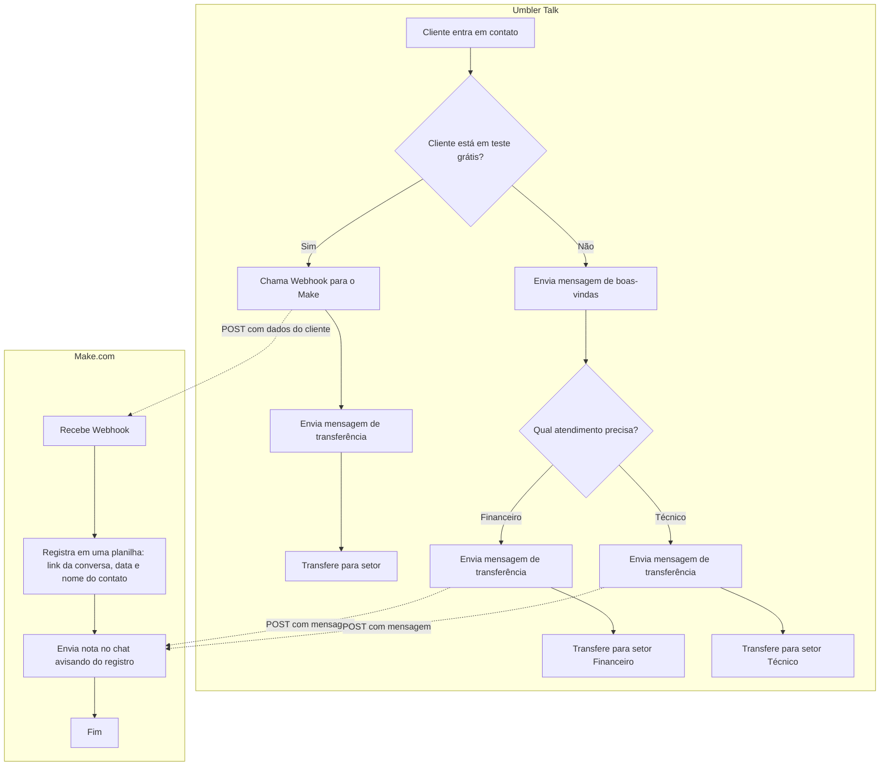

# **Guia de Integração: Plataforma de Chat & Make**

Este guia apresenta a implementação da integração entre uma plataforma de chat e o Make.com, conforme o fluxo definido no desafio técnico.

## **Pré-Requisitos**

Para esta implementação, foram utilizados:

1. **Conta na plataforma de chat:**
   * Canal do tipo "Starter"
   * Credenciais de API da plataforma de chat

2. **Conta no Make:**
   * Conta gratuita criada em: [https://www.make.com/en/register](https://www.make.com/en/register)

3. **Google Sheets:**
   * Planilha configurada para receber os registros das conversas

---

## **1. Visão Geral do Fluxo no Make**

O fluxo implementado no Make segue exatamente o padrão solicitado no desafio:

 

## **2. Configuração do Webhook e Módulos**

### **2.1. Configuração do Webhook**

Foi configurado um webhook personalizado chamado "Trial Webhook" para receber os dados enviados pela plataforma de chat:

* **URL do webhook**: [URL do webhook do Make]
* **Método**: POST

Este webhook é o ponto de entrada no sistema Make, recebendo os dados quando um cliente em teste grátis inicia uma conversa na plataforma de chat.

### **2.2. Configuração do Webhook na Plataforma de Chat**

No lado da plataforma de chat, foi configurado o envio de dados para o webhook no Make:

* **Endpoint**: [URL do webhook do Make]
* **Método**: POST
* **Conteúdo**:
```json
{
  "LinkdaConversa": "https://plataforma-chat.com/chats/{{Conversa.Id}}",
  "NomePrincipalDoContato": "{{Contato.NomeCompleto}}"
}
```

### **2.3. Tratamento de Dados e Variáveis**

Após o recebimento dos dados pelo webhook, foi configurada uma variável "Data_Atual" utilizando a função:

```
formatDate( now ; DD/MM/YYYY HH:mm:ss )
```

Esta variável armazena o momento exato em que os dados foram processados no Make, garantindo consistência no registro temporal das interações.

## **3. Registro de Dados na Planilha**

A etapa seguinte configura o registro dos dados na planilha do Google Sheets:

* **Ação**: Add a Row
* **Colunas configuradas**:
  * **A (LinkDaConversa)**: URL da conversa recebida do webhook
  * **B (NomesCompletos)**: Nome do contato principal
  * **C (Data)**: Data e hora formatadas da interação

A estrutura da planilha foi organizada para facilitar a consulta e análise posterior dos registros.

A solução está operando corretamente, com os dados sendo registrados na planilha conforme o exemplo:

| LinkDaConversa | NomesCompletos | Data |
|----------------|----------------|------|
| [https://plataforma-chat.com/chats/abc123](https://plataforma-chat.com/chats/abc123) | Nome Exemplo | 21/05/2025 21:15:01 |

## **4. Envio de Nota no Chat**

### **4.1. Configuração do Módulo HTTP**

Após o registro na planilha, foi configurado um módulo HTTP para enviar uma nota no chat da plataforma:

* **Método**: POST
* **URL**: `{{1.LinkdaConversa}}/notes` (onde LinkdaConversa é a URL recebida via webhook)
* **Headers**:
  * **Content-Type**: application/json
  * **Authorization**: Bearer [token-de-autorizacao]

* **Body (JSON)**:
```json
{
  "content": "Registro feito no Google Sheets para {{1.NomePrincipalDoContato}} às {{formatDate(now; DD/MM/YYYY HH:mm:ss)}}"
}
```

* **Parse response**: Yes

### **4.2. Resposta do Webhook**

Além disso, o fluxo envia uma resposta ao webhook confirmando o processamento bem-sucedido:

* **Status**: 200
* **Corpo da resposta**:
```json
{
  "status": "sucesso",
  "message": "Webhook processado com sucesso pelo Make."
}
```

Esta confirmação garante que a plataforma de chat reconheça que o processamento foi concluído com êxito.

---

## **Fluxo de Conversação na Plataforma de Chat**

O fluxo completo implementado na plataforma de chat segue o diagrama proposto:

1. Cliente inicia contato
2. Sistema verifica se o cliente está em teste grátis:
   * **Se sim**: Chama webhook → Envia mensagem → Transfere para setor
   * **Se não**: Envia boas-vindas → Pergunta sobre tipo de atendimento → Transfere conforme resposta

## **Resultado Final**

A integração completa possibilita:

1. Identificação automática de clientes em teste grátis
2. Registro centralizado em planilha com dados importantes (link, nome e data)
3. Envio de nota no chat informando sobre o registro
4. Confirmação de processamento via webhook response
5. Direcionamento eficiente para os setores adequados

Esta implementação atende completamente aos requisitos estabelecidos no desafio técnico, proporcionando uma automação eficiente do processo de atendimento a clientes.

---

## **Fluxograma da Integração**



O fluxograma acima representa de forma visual o processo completo de integração, mostrando claramente:

1. O fluxo de decisão na plataforma de chat
2. A etapa de envio de mensagem antes da transferência para o setor
3. O processamento detalhado no Make.com, incluindo a definição da data atual
4. O registro estruturado na planilha Google Sheets
5. O envio da nota de volta para o chat
6. A resposta final do webhook confirmando o processamento
